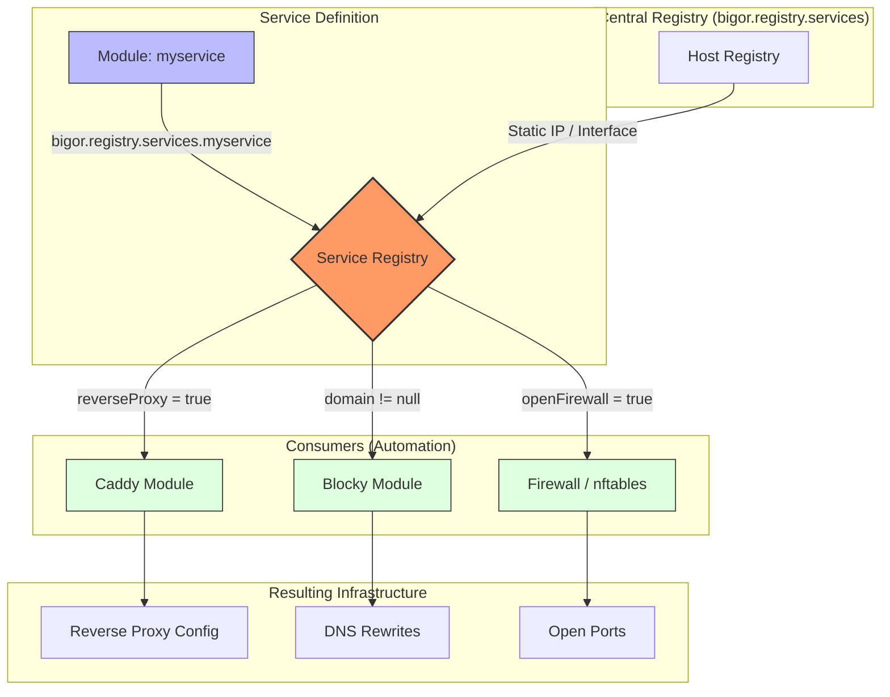

```mermaid
graph TD
    subgraph "Service Definition"
        S[Module: myservice] -- "bigor.registry.services.myservice" --> R
    end

    subgraph "Central Registry (bigor.registry.services)"
        R{Service Registry}
        H[Host Registry] -- "Static IP / Interface" --> R
    end

    subgraph "Consumers (Automation)"
        R -- "reverseProxy = true" --> C[Caddy Module]
        R -- "domain != null" --> B[Blocky Module]
        R -- "openFirewall = true" --> F[Firewall / nftables]
    end

    subgraph "Resulting Infrastructure"
        C --> RP[Reverse Proxy Config]
        B --> DR[DNS Rewrites]
        F --> OP[Open Ports]
    end

    %% Styling
    style R fill:#f96,stroke:#333,stroke-width:2px
    style S fill:#bbf,stroke:#333
    style C fill:#dfd,stroke:#333
    style B fill:#dfd,stroke:#333
    style F fill:#dfd,stroke:#333
```
